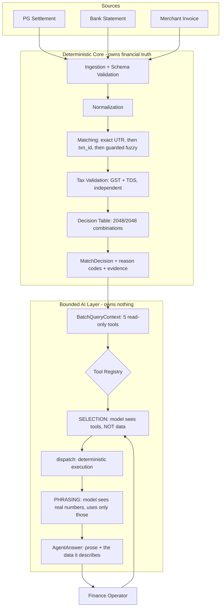

<div align="center">

# AI Finance Controller — Deterministic Reconciliation with a Bounded AI Layer

**A reconciliation engine whose harnesses kept disagreeing with it — and a discipline of checking, every time, which one was wrong.**


</div>

A finance-operations control system that reconciles settlement data across three
independent sources, verifies GST and TDS against Indian tax law, classifies every
unresolved case into an explicit exception state with evidence, and lets a finance
operator ask about the result in plain English — through an agent that chooses which
question to answer and **cannot alter a single number in the answer**.

---

## The Challenge

**Reconciliation is dangerous when the system is confident and wrong.**

| | The Problem | Why It Matters | This Project's Answer |
|---|---|---|---|
| **Fail-open matching** | A record that should reach a human gets silently auto-matched. It looks like success. | An unreviewed discrepancy is worse than a flagged one — nobody goes looking for it | Six fail-open cases were found by a full-batch harness **while 162 unit tests were passing**. Root-caused to the data generator, not the engine. |
| **LLMs near money** | A model that can touch a financial figure can be confidently, invisibly wrong | Tax and settlement numbers are auditable facts, not generated text | The model selects a tool and writes prose. It has **no field, argument, or code path** through which a financial fact can pass. Proven by test and re-verified live in the demo. |
| **Metrics that lie** | A number that looks like an engine weakness may be measuring something else entirely | A documented limitation is worthless if it documents the wrong thing | Three "engine weaknesses" turned out to be measurement defects. All three are written up in [`FAILURE_LOG.md`](FAILURE_LOG.md), including the ones that make the project look bad. |

---

## Overview



The boundary is the point: **deterministic code owns financial truth; the model
retrieves, explains, and investigates.** It never becomes the source.

---

## Architecture

### Project Structure

```text
razorpay-ai-finance-controller/
│
├── src/
│   ├── config.py                     Single source of truth: tax rates, tolerances, seed
│   ├── models.py                     Pydantic contracts; Decimal firewall rejects float/bool
│   ├── financial.py                  Settlement arithmetic — one definition, imported everywhere
│   │
│   ├── ingestion/loader.py           Per-record fault isolation — one bad row ≠ dead batch
│   ├── normalization/engine.py       Canonical NormalizedRecord, UTC anchoring
│   │
│   ├── matching/
│   │   ├── candidates.py             Three-tier search + ambiguity detection
│   │   ├── scoring.py                Confidence tiers from three-source signals
│   │   └── engine.py                 Deterministic tie-breaking, rejected candidates kept
│   │
│   ├── tax/
│   │   ├── validator.py              GST on MDR; TDS s.393 (ex-194-O) threshold logic
│   │   └── seller_ledger.py          Per-record YTD opening balance, not batch-reconstructed
│   │
│   ├── exceptions/
│   │   ├── decision_table.py         Priority-ordered policy — data, not if/elif
│   │   └── manager.py                DecisionContext construction + violation preservation
│   │
│   └── agent/
│       ├── contracts.py              Frozen types with no vocabulary for financial facts
│       ├── guardrails.py             Preemptive timeout via ThreadPoolExecutor
│       ├── tool_selection.py         ToolSelection contract + strict parser
│       ├── controller.py             explain() and ask() — the agent loop
│       ├── explanation_validator.py  Faithfulness checks on generated prose
│       ├── providers/                LLMProvider ABC + Gemini implementation
│       └── tools/
│           ├── query_tools.py        Five read-only tools over decide_batch() output
│           ├── registry.py           Tool specs, strict argument validation
│           └── candidate_lookup.py   Read-only index consumer
│
├── scripts/                          Generation, verification, evaluation, demo
├── tests/                            326 tests across 26 files
├── data/
│   ├── raw/                          Generated PG / bank / invoice sources
│   ├── ground_truth.json             Never read by the pipeline — evaluation only
│   └── eval/                         Recorded benchmark and real-model artifacts
│
├── ARCHITECTURE.md                   Where truth lives; the N:1 design not built
├── FAILURE_LOG.md                    Every defect, including the embarrassing ones
└── requirements.txt
```

### Core Components

| Module | Responsibility |
|---|---|
| `financial.py` | `expected_net = gross − fee − GST − TDS` in **one** place. It previously existed as four inline copies that agreed by coincidence, not by construction; a structural test now fails if a fifth appears |
| `models.py` | Money as `Decimal` only — `float` and `bool` are rejected at the ingestion boundary, before any business logic runs |
| `matching/candidates.py` | Strongest-evidence-first: exact UTR, then resolved txn_id, then amount+date-guarded fuzzy. Similarity alone can never authorise a match. |
| `tax/validator.py` | Verifies the GST *relationship* against MDR rather than trusting the claimed value. GST and TDS evaluated independently so neither can suppress the other. |
| `exceptions/decision_table.py` | Priority-ordered rules, exhaustively tested over all 2¹¹ = 2048 context combinations |
| `exceptions/manager.py` | Builds the decision context; preserves *every* violation in `reason_codes` while `status` stays single-valued |
| `agent/guardrails.py` | Real preemptive timeout — a 15s hang returns in under 12s, verified by regression test |
| `agent/tools/query_tools.py` | Five read-only tools, including the cash position in rupees. No method recomputes a financial outcome; the absence is asserted structurally, not left to review. |
| `agent/controller.py` | `ask()` — select tool → dispatch deterministically → phrase the real result |

---

## Domain

**Track 04 — AI Finance Controller.** *"Build an agent that closes one finance-ops loop
across a 50+ record batch of synthetic data, reporting its match rate and the exceptions
it could not resolve."*

**Scope chosen:** multi-source settlement reconciliation with tax-line verification as its
terminal step, made queryable by a Settlement Q&A agent. One loop, not three features — in
a real settlement workflow tax verification *is* the last step of reconciliation.

**Tax basis:** GST at 18% on the payment-gateway fee; TDS under **Section 393(1) Sl. 8(v)**
of the Income Tax Act, 2025 (formerly Section 194-O) at 0.1% above a ₹5,00,000 annual
threshold, evaluated against a per-record merchant YTD opening balance.

---

## Why These Design Choices

**Deterministic code owns financial truth; the model owns nothing.** The agent contracts
(`ToolSelection`, `NarrationExtraction`, `Explanation`) are frozen dataclasses with no
field for amount, status, tax, or exception code. This is structural, not behavioural — the
model cannot express a financial fact because there is nowhere to put one. A test greps
field names to keep it that way.

**Exceptions are a first-class output, not a failure.** `HUMAN_REVIEW` is a correct outcome.
The decision table routes uncertainty there rather than guessing, and every unresolved
record carries an exception code plus the complete set of violated conditions.

**A single status is not enough audit evidence.** A transaction with both a GST and a TDS
error reports `status = TAX_MISMATCH` while `reason_codes` retains both
`ERR_GST_MISMATCH` and `ERR_TDS_VARIANCE`. Status classifies; reason codes explain.

**Independent statutory controls stay independent.** An early version suppressed a TDS
mismatch whenever GST had already failed — which would report one statutory issue and hide
another. Fixed, and regression-tested.

**Identity and financial correctness are different questions.** The amount check was once
gated on a confidence score that was itself partly derived from the amount signal. An amount
discrepancy dragged confidence down, then used that drop to skip the check that would have
reported it. Removing the gate cut baseline divergences from 19 to 11.

**`tax_verified` is three-state.** `True` means verification ran and passed; `False` means it
ran and failed; `None` means it never ran. Deriving it from mismatch flags alone reported
`True` on a record with no invoice at all — a fail-open in the reporting layer that fed
straight into the explanation the operator reads.

**Ground truth must describe what the decision table actually produces.** Two labels asserted
statuses the engine cannot reach, making a correct engine look broken. A generation-time
reachability check now fails loudly if a category claims a status no rule produces.

**When the harness and the engine disagree, check which one is wrong.** Every time this
happened, it was the harness. See below.

---

## Results

### Reconciliation — full batch, no sampling

| Decision Status | Count | Meaning |
|---|---|---|
| `MATCHED` | 24 | Clean across all three sources, tax verified |
| `HUMAN_REVIEW` | 19 | Amount mismatch, duplicate, degraded signals, or fuzzy-only linkage |
| `TAX_MISMATCH` | 7 | GST or TDS variance against statutory expectation |
| `AMBIGUOUS` | 6 | A competing record exists; no safe automatic choice |
| `PARTIAL_MATCH` | 3 | Invoice missing — tax could not be verified |
| `UNMATCHED` | 2 | Bank row absent, or malformed record rejected at ingestion |
| **Total** | **61** | Every record, unfiltered |

**Match rate: 39.34%** — and that number needs its context. The dataset is deliberately
adversarial: ten anomaly categories with only 18 clean records by construction. **A high
match rate here would mean the exceptions were not being caught.**

Upgrade B lowered this from 49.18%. Six `reference_mismatch_fuzzy` records moved from
`MATCHED` to `HUMAN_REVIEW` once the fuzzy tier became reachable and the engine's
fail-closed behaviour became visible for the first time. See Measured Accuracy below.

### Measured accuracy — against independent ground truth

| Measure | Result |
|---|---|
| Status accuracy | **55/61 (90.16%)** |
| Exception-code accuracy | **55/61 (90.16%)** |
| Records rejected at ingestion | 2 (corrupted — counted, not dropped) |
| Divergences | 6, all in one category, all fail-closed |

Eight of ten categories score 100%, including the six ambiguous cases the per-case harness
cannot evaluate. Ground truth is generated alongside the data and never read by the pipeline.

**The six divergences are the engine declining to auto-approve.** Records in
`reference_mismatch_fuzzy` are recovered by the fuzzy tier — narration similarity, with
amount and date agreement enforced — and then routed to `HUMAN_REVIEW` because no
structured identifier agrees anywhere. Ground truth expected auto-match.

We kept the engine. A settlement whose only link to a transaction is a fuzzy string match
is not something a finance system should approve without a human. Correcting the label
would have restored 100%; it would also have been a third ground-truth edit, and **a number
that needed the target moved is worth less than one that did not.**

Recorded as `KNOWN_POLICY_DIVERGENCE` in
`data/eval/e2e_gold_baseline_verification_5C5_2.json`, with the rationale attached to each
case. Two earlier label corrections (`duplicate`, `unresolvable`) are disclosed in
`data/eval/accuracy_report.json` and `FAILURE_LOG.md` §14–15.

*What this measures:* the implementation matches its own specification across ten
adversarial categories. That is narrower than "handles reconciliation" — see Known
Limitations.

### Verification

| Measure | Result |
|---|---|
| Test suite | **326 passing** across 26 files |
| Decision policy coverage | **2048/2048** context combinations resolve deterministically |
| Gold baseline (per-case E2E) | **0 unexplained divergences** · 51 exact · 6 not-evaluable · 6 known-policy |
| Fuzzy tier | **6 of 61 records reach it** (was 0). Precision 1.00, recall 1.00 through threshold 90, 0.50 at 95 |
| Throughput | **1,348.5 records/sec** at batch 60. Matching is **O(n²)** — 179.2 rec/sec at 5,000. See below |
| Explanation faithfulness | 8/8 status preserved · 8/8 amounts preserved · 8/8 tax preserved · **0 unsupported claims** · **0 safety-critical failures** |
| Real-model agent verification | **6/6** data invariant held · 6/6 tool selection matched expectation |

### Throughput scales quadratically, and the published figure hid it

| Batch | Match time | Total | Records/sec |
|---|---|---|---|
| 60 | 0.004s | 0.04s | 1,348.5 |
| 300 | 0.079s | 0.13s | 2,254.4 |
| 1,000 | 0.836s | 0.95s | 1,052.1 |
| 5,000 | **27.3s** | 27.9s | **179.2** |

Five times the records costs roughly **twenty to thirty times** the
matching time. The cause is `find_bank_ambiguity_candidates()`, which
scans the full bank pool for every PG record to answer *"does a competing
record exist?"* — an O(n²) sweep, and the price of detecting ambiguity
at all.

**The previously published sweep was measured before that scan existed.**
`data/throughput_benchmark.json` was last written at `phase-4-final`;
the ambiguity scan arrived in Phase 5B. Every figure quoted since
described an engine that no longer ran. The number was not wrong when
recorded — it was never re-recorded.

`benchmark_throughput.py` had predicted it in its own output the whole
time: *"if match_time grows faster than linearly, that's real evidence of
an O(n²) bottleneck worth investigating, not a claim to hide."* The stale
artifact is what hid it. Written up in [`FAILURE_LOG.md`](FAILURE_LOG.md)
§54.

At the 61-record batch this system targets, the cost is 4 milliseconds.
It is a real ceiling for production scale and is stated as one rather
than left for a reviewer to discover.

### The invariant that matters

Every answer the agent gives is re-verified against a direct tool call:

```text
answer.data == getattr(context, answer.tool_used)(**answer.tool_arguments)
```

A stubbed model that returns *"All 9999 records matched perfectly"* still produces
`data == context.get_match_rate()`. Held on **6/6** live Gemini questions and on every
question in the demo.

---

## What Went Wrong (and how it was found)

The most useful thing built here was not the engine. It was the set of harnesses that kept
disagreeing with it.

| Reported as | Actually was |
|---|---|
| Six records auto-matched that should have gone to a human | The **generator** never emitted a colliding bank row, so ambiguity was asserted in ground truth but did not exist in the data. 162 unit tests passed throughout — the guarding test checked *"if flagged ambiguous, never auto-match"*, and nothing was ever flagged. |
| Ground-truth divergences | Labels asserting statuses the decision table **cannot produce** |
| Fuzzy precision 0.13 | A benchmark **counting correct matches as false positives** — narration embedded the UTR verbatim, so every clean record scored 100. The tell was FP staying at exactly 43 across thresholds 60–95. |

**In every case the deterministic engine was right and the instrument was wrong.**

Rewriting the fuzzy benchmark surfaced a second fact: **zero of 61 records reached the
fuzzy tier.** `bank_ref` encoded the txn_id, so tier 2 always resolved first — a convention
introduced for generator convenience that had made an entire code path dead. Removing it
took the count from 0 to 6, and broke three separate evaluation scripts that had quietly
come to depend on it.

Making the tier run for the first time then exposed something the engine had always done
and nobody had been able to test: it **declines to auto-match on fuzzy-only evidence.**
Accuracy fell from 100% to 90.16% as a direct result.

Full write-up, including the corrections to this log's own earlier claims:
**[`FAILURE_LOG.md`](FAILURE_LOG.md)**

---

## Known Limitations

Stated plainly so none of the above is read as more than it is.

- **Settlement is modelled 1:1.** One PG transaction to one bank credit. Real settlements are
  *batched* — many transactions net into one transfer, minus refunds and chargebacks. The
  hard part of real reconciliation is decomposing that, and this system never has to.
  What it would take — which layers change, which do not, and the paise-netting trap that
  makes a per-line tolerance unsafe at batch scale — is specified in
  [`ARCHITECTURE.md`](ARCHITECTURE.md#n1-batched-settlement--the-design).
- **MDR is method-aware but simplified.** UPI is zero-rated, cards 2%, netbanking
  1.8% — drawn from `config.MDR_BY_METHOD` rather than a flat percentage. Real netbanking
  is often a *flat* per-transaction fee, and capped RuPay debit and ~3% international cards
  are not modelled at all.
- **Bank narration formats are invented.** Five formats now instead of one, drawn from what
  Indian banks emit, but still synthetic. Only `reference_mismatch_fuzzy` uses a bank-native
  reference; every other category still uses `BANKREF_<txn_id>`, a convention no real bank
  provides.
- **The fuzzy tier is reachable but not stress-tested.** Six records reach it and it recovers
  all six. But accidental net collisions in this dataset are zero, so the amount guard
  already identifies the correct row before similarity is consulted — the fuzzy score is
  doing no discriminating work. **Precision 1.00 means "the guards are selective here", not
  "narration matching works."** Making narration load-bearing needs amount collisions inside
  the guard window, which is a deliberate dataset change.
- **Every bank narration currently carries a recoverable UTR.** The narration format that
  would carry no transaction reference at all — a UPI reference instead — exists in the
  generator but is unreachable, because every caller passes a real UTR. So the dataset
  contains no case the deterministic path genuinely cannot solve. That absence is why the
  LLM extraction path has no job here; see `FAILURE_LOG.md` §50.
- **Held-out explanation evaluation is 8 cases**, one per category. Real measurements, but
  closer to anecdote than statistic. The held-out narration set has 20 cases across 10
  adversarial categories including prompt injection, but it evaluates `TXN_` token
  extraction — a format Upgrade B removed from bank narration, so it no longer reflects
  production data.
- **LLM-assisted candidate matching is built but not connected.**
  `find_bank_candidates_with_llm_assist` exists and is deliberately off the live path. On
  this dataset the deterministic tier recovers everything it would have, at precision 1.00.
- **Agent tool-selection accuracy is six questions.** A smoke test, not an evaluation.
- **Throughput is a recorded benchmark on one machine**, not a production capacity guarantee.
- **The dataset is synthetic and self-generated.** Results characterise this dataset.

---

## Project Status

- [x] **Phase 0** — Financial constitution: Decimal firewall, typed contracts, config
- [x] **Phase 1** — Adversarial dataset: 10 categories, independent ground truth, reachability guards
- [x] **Phase 2** — Ingestion + normalization: fault isolation, canonical records
- [x] **Phase 3** — Matching: three-tier search, deterministic tie-breaking, ambiguity detection
- [x] **Phase 4** — Tax + decisions: independent GST/TDS, 2048-combination decision table
- [x] **Phase 5A** — AI boundary: preemptive timeout, frozen contracts, invariance tests
- [x] **Phase 5B** — Real model: Gemini 3.1 Flash-Lite behind the boundary
- [x] **Phase 5C** — Evaluation: held-out sets, faithfulness scoring, gold baseline harness
- [x] **Phase 6** — Agent: tool layer, registry, `ask()` loop, real-model demo
- [x] **Upgrade B** — Realistic narration formats; fuzzy tier reachable for the first time
- [ ] Connected LLM candidate matching
- [ ] Expanded held-out evaluation (8 → 30 cases)
- [ ] Batched settlement (N:1 decomposition)

Release tags: `phase-3-final` → `phase-4-final` → `phase-5-boundary` → `phase-5-final` → `phase-6-final`

---

## Installation & Setup

```bash
git clone https://github.com/SuryaSK-dev/razorpay-ai-finance-controller.git
cd razorpay-ai-finance-controller
python -m venv .venv
source .venv/Scripts/activate      # Windows Git Bash
pip install -r requirements.txt
```

### Run the full test suite

No credentials required — the suite is hermetic by design.

```bash
pytest tests/ -v
```

### Regenerate data and run the pipeline

```bash
python scripts/generate_data.py          # deterministic, seeded
python scripts/verify_data.py            # structural + tax-math checks
python scripts/benchmark_throughput.py   # 60 / 300 / 1000 / 5000
python scripts/tune_fuzzy_threshold.py   # tier reachability + selection accuracy
python scripts/report_accuracy.py        # measured accuracy vs ground truth
```

To rebuild the frozen E2E baseline after regenerating data, run
`build_e2e_benchmark.py`, then `run_e2e_deterministic.py`, then
`verify_e2e_gold_baseline.py`, in that order.

### Run the demo — no API key needed

```bash
python scripts/demo_agent.py --offline
```

Same loop, same tools, same data-invariant check, with a deterministic stub in place of
the model. Proves the pipeline and the guardrails; demonstrates nothing about model
behaviour, and says so.

### Run the demo with the real model

```bash
cp .env.example .env                                  # then add your key
export $(grep -v '^#' .env | grep -v '^$' | xargs)
python scripts/demo_agent.py
```

Ten Gemini calls (selection + phrasing per question). Free tier is enforced in config —
there is no paid-model fallback path.

**Note:** the test suite is hermetic, but the real-model scripts are not. They require
`.env` to be exported first and will fail with `RuntimeError: GEMINI_API_KEY is not
configured` otherwise. This is documented rather than handled in code — see
`FAILURE_LOG.md` §34.

---

## Agent Example

```text
Q4. Why is TXN_00031 not fully matched?

  tool selected : get_evidence
  arguments     : {'txn_id': 'TXN_00031'}
  answer source : llm

  TXN_00031 is not fully matched due to an AMOUNT_MISMATCH exception.
  The bank amount of 96965.86 differs from the pg_expected_net of
  96970.86 by a delta of 5.00. Additionally, the date_invoice is not
  matched, resulting in a low confidence score of 84.

  VERIFIED: identical to calling the tool directly.
            The model chose the question and wrote the prose.
            Every number came from the engine.
```

The five tools available to the agent:

| Tool | Returns |
|---|---|
| `get_match_rate` | Counts by status and confidence tier across the full batch |
| `get_exceptions(status?)` | Every unresolved record, itemised — never a sample |
| `get_evidence(txn_id)` | Full audit trail for one transaction, including which rule fired |
| `get_cash_position` | The batch in **rupees**: settled, awaiting verification, blocked, and expected-but-not-credited — plus the variance against what the bank actually moved |
| `get_throughput_report` | Recorded throughput, leading with the run closest to the batch size |

An invented tool name is rejected, never defaulted. An invented argument is rejected, never
dropped. A hallucinated transaction ID returns an honest failure, never a fabricated record.

---

## Tech Stack

Python 3.11 · Pydantic v2 · RapidFuzz · Google GenAI (Gemini 3.1 Flash-Lite) · Pytest · Decimal arithmetic throughout

---

<div align="center">

Built for the Razorpay AI Buildathon, Track 04 —
with every strong result checked against the code path that produced it before being trusted.

</div>
